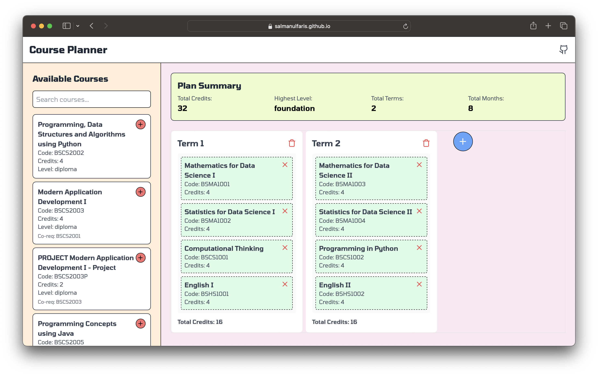

# 📚 Course Planner App

  
  
  

> A powerful and intuitive course planning tool designed specifically for IIT BS students to efficiently plan their academic journey.

  

## ✨ Features

- 📅 Create and manage multiple terms
- 🔍 Search and filter available courses
- 🧩 Drag-and-drop interface for course selection
- ⚖️ Automatic prerequisite and corequisite validation
- 📊 Real-time credit calculation and progress tracking
- 📱 Responsive design for desktop and mobile devices
- 💾 Export and import course plans as JSON
- 🎨 Modern and intuitive user interface

## 🛠️ Technologies Used

- Vue 3
- Tailwind CSS
- Lucide Icons
- Vite (for build and development)

## 🚀 Installation and Setup

1. Clone the repository:
   \`\`\`
   git clone https://github.com/salmanulfaris/course-planner.git
   \`\`\`

2. Navigate to the project directory:
   \`\`\`
   cd course-planner
   \`\`\`

3. Install dependencies:
   \`\`\`
   npm install
   \`\`\`

4. Start the development server:
   \`\`\`
   npm run dev
   \`\`\`

5. Open your browser and visit `http://localhost:3000`

## 📖 Usage

1. Browse available courses in the sidebar
2. Drag courses into term containers or use the quick-add button
3. Rearrange courses between terms as needed
4. View your plan summary at the top of the page

## 🤝 Contributing

We welcome contributions from the community! If you'd like to contribute to the Course Planner App, please follow these steps:

1. Fork the repository
2. Create a new branch: `git checkout -b feature/your-feature-name`
3. Make your changes and commit them: `git commit -m 'Add some feature'`
4. Push to the branch: `git push origin feature/your-feature-name`
5. Submit a pull request

Please make sure to update tests as appropriate and adhere to the existing coding style.

### Roadmap

- [x] Implement export functionality for saving course plans as JSON
- [x] Implement import functionality for loading saved course plans
- [x] Make Responsive layout

contributers are invited.

## 🐛 Bug Reports and Feature Requests

If you encounter any bugs or have ideas for new features, please open an issue on our GitHub repository. When reporting bugs, please provide as much detail as possible, including:

- Steps to reproduce the bug
- Expected behavior
- Actual behavior
- Screenshots (if applicable)
- Browser and operating system information

## 📈 Future Enhancements

We're constantly working to improve the Course Planner App. Some planned enhancements include:

- Integration with university registration systems
- Collaborative planning features for study groups
- Advanced analytics for optimizing course load and graduation time
- Personalized course recommendations based on academic goals and performance

## 🙏 Acknowledgements

We'd like to thank the following open-source projects and communities that made this app possible:

- [Vue.js](https://vuejs.org/)
- [Tailwind CSS](https://tailwindcss.com/)
- [Lucide Icons](https://lucide.dev/)
- [Vite](https://vitejs.dev/)

## 📄 License

This project is open source and available under the [MIT License](LICENSE).

Made with ❤️ by [Salmanul Faris](https://github.com/salmanulfaris)

